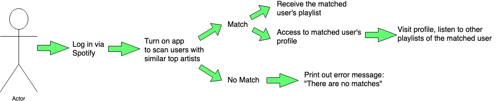
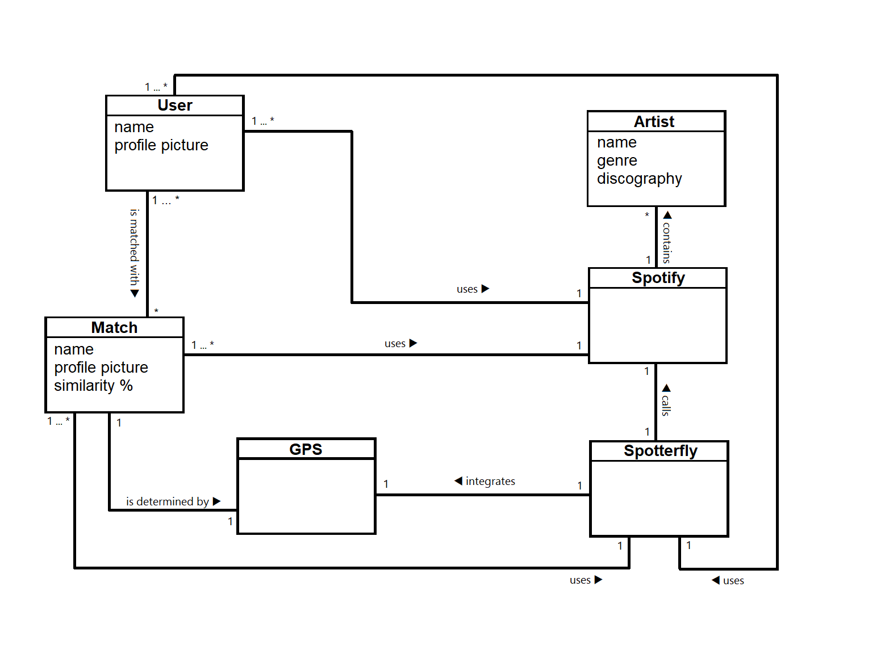

# Spotterfly Project Requirements
### Functional Requirements
* Location based service that finds the users of the app in proximity to you.
* Spotify API to receive the user's playlists and top artists as well as the matched user's playlists and top artists.
* Playlist matching system that allows users to find which user's top artists match with that of the user.
* Ability to open the matched user's profile.
* Spotify player to allow users to play the matched user's top playlist.
* Allowing users to log in to the app via spotify log in.

### Non-Functional Requirements
* Projection Completion: by the end of semester
* Frameworks:
    * Front End: HTML, CSS, React.js
    * Back End: Express.js, Node.js
    * Database: MongoDB
* App should maximize uptime; be online and functional at all times.

### 1. Stakeholder Interview
We conducted stakeholder interviews with Amos Bloomberg (Professor). During the video conversation, after we explained the details of Spotterfly, we talked about these questions and answers to facilitate our conversations.
* What are some tools we should be learning to implement this app?
    * Use the MERN Stack:
        * **M**ongoDB for databse
        * **E**xpress.js for backend
        * **R**eact.js for frontend
        * **N**ode.js for backend
    * Use built in JavaScript function to grab location from the user.  
* Should this be an mobile or web app?
    * Make it an web app as learning the MERN stack and web app tools are important.  
* What would success look like for this project?
    * Make it strictly an app for matching recently played playlists with the match of their top artists.
    * Can’t run in the background, only grab location when you are using the app.

### 2. End-User Observation
##### Cheryl J. King
* **Cheryl's basic information:**
    Age- 19
    location - NYC
    Life - Cheryl has a busy life between working at The Wiz as a Terrazzo worker, and "hanging out" with her friends.  
* **Cheryl's Goals:**
    Cheryl wants to be able to find music to show her friends without having to take the time out of her day to look through Spotify's recommended playlists for hours.  
    Cheryl wants to be able to quickly find music at her own pace when she has a free minute.
* **Cheryl's motivation:**
    Cheryl doesn't want to play the same songs every day she is at work, doing homework, walking to and from class.  
    Cheryl wants to mix things up but doesn't want to get too distracted from what she needs to do.
* **Cheryl's frustration:**
    Cheryl can't find the time to go through all of the lists spotify sends her.
    Cheryl doesn't want to listen to things that all sound like the same song.
    Cheryl has taken all of her friends similar music, but is out of songs to expand to.
    Cheryl has been listening to the same songs for too long.
    When Cheryl is at work playing music people sometimes complain they have been hearing the same songs on repeat too much.
* **Cheryl's everyday activity:**
    Cheryl wakes up gets ready for the day and throws in her headphones.  
    Cheryl goes to class listening to music.
    Cheryl throws her music back on after class on her way to work.
    Cheryl works diligently through the day as a Terrazzo worker where she applies specialized surfaces and finishes to the interior and exteriors of buildings and grounds and does other similar tasks while cranking her music through the loud speakers.  
    Cheryl finishes her day at work, throws in her headphones, and walks back to start her nighttime classes.
    Cheryl listens to her music on her way home, cooks dinner and studies for the night throwing music on her Bluetooth speaker when she gets home.
    Cheryl turns off her music, finishes up her emails, surfs the web for a bit and goes to bed.

### 3. Use Cases

#### Use Case 1:
Title: Find New Playlist
Actor: Spotify User
Scenario:
1. User logs in to the spotterfly app using spotify log in.
2. User turns on the app
3. The app scans if anyone who turned on the app in the vicinity has similar artists in their top songs playlist as those of the user.
4. If there are matches with their top songs playlist, user receives the top songs playlist of the matched user.
5. User can take a look at the playlist they received and listen to see which new songs they would like to incorporate into their library.
6. When there is no match, app gives out a message that says “There are no matches”.

#### Use Case 2:
Title:  Visit matched users’ profiles
Actor: Spotify user
Scenario:
1. User logs in to the spotterfly app using spotify log in.
2. User turns on the app
3. The app scans if anyone who turned on the app in the vicinity has similar artists in their top songs playlist as those of the user.
4. If there are matches with their top songs playlist, user receives the top songs playlist of the matched user.
5. Along with the top songs playlist of the matched user, user also has access to the matched users’ profile.
6. With the access to the matched users’ profile, they can visit their profiles so user can see the other playlists of the matched user and more songs of what the matched user listens to.

### 4. Domain Modeling
